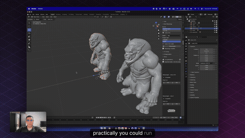

# Alpha3D for Blender

### The full AI 3D pipeline, inside your viewport.

Generate a model from a prompt or a photo, then retopologize, segment, and auto-rig it, without ever leaving Blender.

&nbsp;
&nbsp;
&nbsp;

 

The GIF is a highlight loop. Click it, or the button above, for the full walkthrough.

---

## What it is

**Alpha3D for Blender** brings [Alpha3D](https://alpha3d.io)'s AI 3D pipeline into the Blender N-panel. Most AI tools stop at a dense, triangle-soup mesh and leave the rest to you. This add-on runs the whole chain, generation through rigging, right next to your viewport, and drops every result straight into your open scene as standard, editable Blender geometry.

- **No round-trips.** Generate, refine, and rig without a browser tab or a download-and-reimport dance.
- **Production-usable output.** Smart retopology turns a generated mesh into clean, quad-friendly topology that actually deforms and subdivides.
- **One account, everywhere.** Anything you make in Blender shows up in your Alpha3D library, and vice versa.

## What you can do

Everything lives in **View3D → Sidebar (`N`) → Alpha3D**.

| Tool | What it does | Runs |
| --- | --- | --- |
| **Text & Image to 3D** | A prompt or a reference photo becomes a mesh in your scene. Three quality tiers (Low-Poly, High-Res, Ultra High-Res) with a PBR toggle, and the credit cost shown before you commit. | In Blender |
| **Smart Retopology** | Rebuild a dense mesh into clean, quad-friendly, animation-ready topology. | In Blender |
| **AI Segmentation** | Split a model into labeled, rig-ready parts, imported grouped under a single parent. | In Blender |
| **AI Rigging** | Auto-rig a humanoid T-pose (armature + skin weights), with an advisory T-pose check before you spend a credit. | In Blender |
| **Library** | Browse your generations and jobs, watch status update live, and import any finished asset with a download progress bar. | In Blender |
| **UV Unwrapping** · **AI Texturing** · **Asset Tagging** | Open the matching tool on the Alpha3D web app, working on your model's original mesh. | On the web |

Generated meshes import into your active scene as ordinary geometry, ready to edit, texture, and export like anything else you build in Blender.

## Install

The add-on is free to install.

1. **Get the zip.** Download it from **[alpha3d.io/plugins](https://alpha3d.io/plugins)** (the *Get the Blender add-on* button) or from this repo's [Releases](../../releases).
2. In Blender: **Edit → Preferences → Add-ons → Install from Disk**, and pick the zip.
3. Enable **Alpha3D** in the add-on list.
4. Open the sidebar in the 3D viewport (`N`) and select the **Alpha3D** tab.

> Developers can instead clone this repo and zip the `alpha3d_plugin/` folder (so the archive contains `alpha3d_plugin/__init__.py`), or symlink it into Blender's `scripts/addons/`.

**Compatibility:** Blender 4.0 and newer (tested through 5.0), on Windows, macOS, and Linux.

## Connect your account

Click **Connect** in the Alpha3D tab. Your browser opens the Alpha3D login and links the session back to Blender. The add-on never handles your password; it stores a standard 30-day account token in the add-on preferences.

## What you need

An **[Alpha3D](https://alpha3d.io) account with credits.** The tools run in Alpha3D's cloud, so generating, retopologizing, segmenting, and rigging spend credits from your account (credits are shared with the web app). The **€5 Tester plan** has enough to take a first asset from prompt to rigged.

## Links

- **Website:** [alpha3d.io](https://alpha3d.io)
- **What the plugin does:** [alpha3d.io/blender-ai-plugin](https://alpha3d.io/blender-ai-plugin)
- **Download & connect:** [alpha3d.io/plugins](https://alpha3d.io/plugins)
- **Pricing:** [alpha3d.io/pricing](https://alpha3d.io/pricing)
- **Full demo:** [youtu.be/tLO_ceGiiPo](https://youtu.be/tLO_ceGiiPo)

---

Built by <a href="https://alpha3d.io">Alpha3D</a>. Generate, refine, and rig, in one place.

